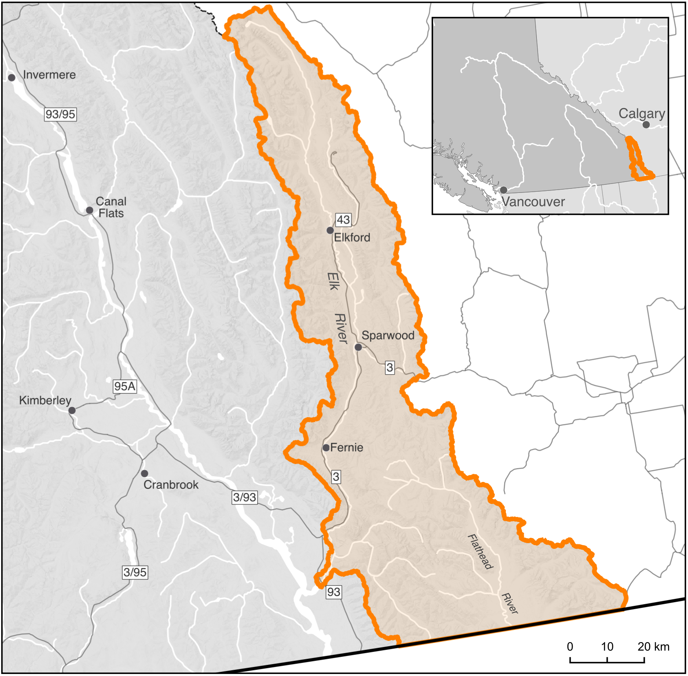
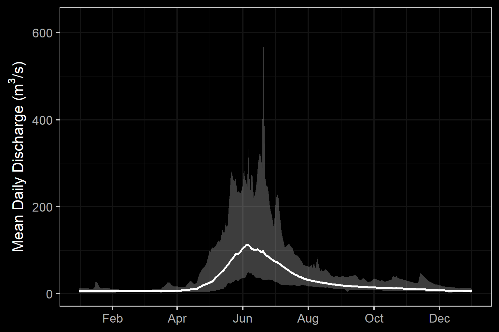
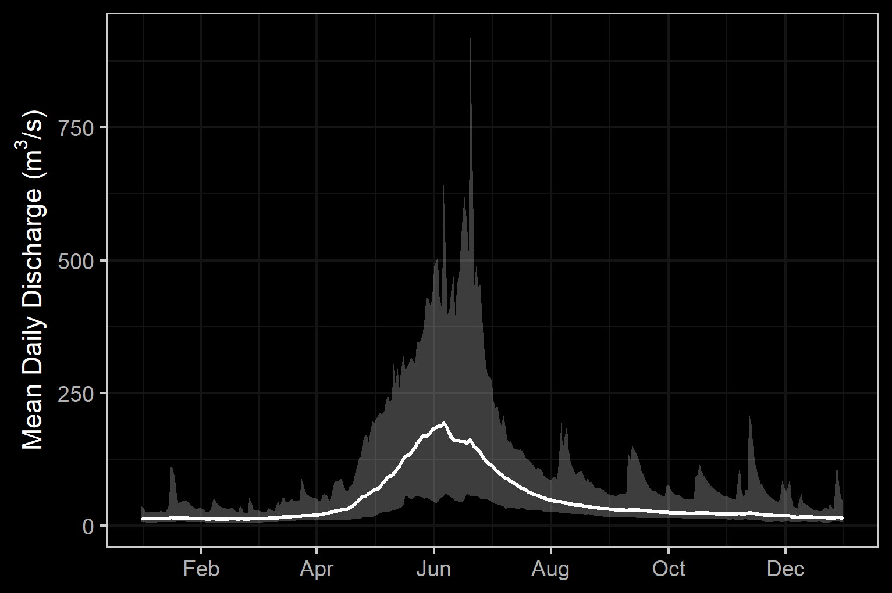
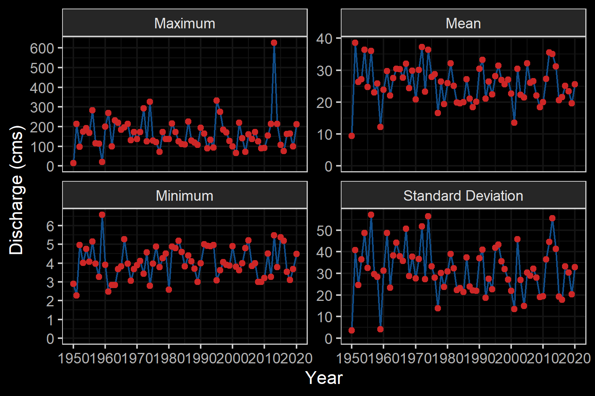
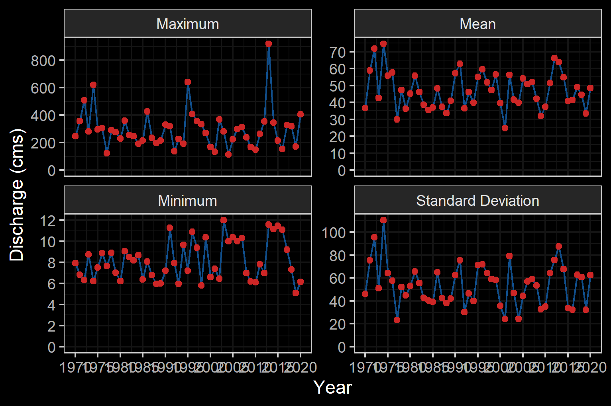

--- 
title: "Elk River Watershed Group Fish Passage Restoration Planning 2022"
author: |
 |
 |
 | Prepared for
 | Nupqu Resource Limited Partnership
 |
 |
 | Prepared by
 | Al Irvine, B.Sc., R.P.Bio.
 | New Graph Environment Ltd.

date: |
 |
 | Version 0.0.1
 | `r format(Sys.Date(), "%Y-%m-%d")`
toc-title: Table of Contents
site: bookdown::bookdown_site
output: 
  bookdown::gitbook:
          includes:
            in_header: header.html
nocite: |

documentclass: book
bibliography: [book.bib, references.bib, packages.bib]
biblio-style: apalike
link-citations: no
github-repo: rstudio/bookdown-demo
description: "2022 Reporting for Fish Passage Restoration Planning Assessments in the Elk River watershed group."

---


```{r switch-gitbook-pagedown, echo=FALSE}
gitbook_on <- TRUE
# gitbook_on <- FALSE  ##we just need turn  this on and off to switch between gitbook and pdf via paged.js

```


```{r setup, echo=identical(gitbook_on, TRUE), include = TRUE}
knitr::opts_chunk$set(echo=identical(gitbook_on, TRUE), message=FALSE, warning=FALSE, dpi=60, out.width = "100%")
# knitr::knit_hooks$set(webgl = hook_webgl)
options(scipen=999)
options(knitr.kable.NA = '--') #'--'
options(knitr.kable.NAN = '--')
```

```{r load-data}
source('R/packages.R')
# source('R/functions.R')
# source('R/private_info.R')
# source('R/tables.R')
```


```{r settings-gitbook, eval= gitbook_on}
photo_width <- "100%"
font_set <- 11

```

```{r settings-paged-html, eval= identical(gitbook_on, FALSE)}
photo_width <- "80%"
font_set <- 9
```


```{r include=FALSE}
# automatically create a bib database for R packages
knitr::write_bib(c(
  .packages(), 'bookdown', 'knitr', 'rmarkdown'
), 'packages.bib')
```

# Acknowledgement {.front-matter .unnumbered}


Modern civilization has a long journey ahead to acknowledge and address the historic and ongoing impacts of colonialism that have resulted in harm to the cultures and livelihoods of those that have lived in harmony with the land for many thousands of years. That harm extends naturally to the ecosystems themselves. 


```{js, logo-header, echo = FALSE, eval= T}
title=document.getElementById('header');
title.innerHTML = '' + title.innerHTML
```


<!--chapter:end:index.Rmd-->


# Introduction {#intro}

Nupqu Resource Limited Partnership (Nupqu) was retained by the Canadian Wildlife Federation in the summer of 2021 to conduct fish passage and habitat confirmation assessments at road-stream crossings and dams within the Elk River watershed group as part of connectivity restoration planning targeting westslope cutthrout trout. New Graph Environment Ltd. was sub-contracted by Nupqu to assist with project delivery. The assessments conducted in 2021 complement work completed in 2020 (72 fish passage assessments and 15 habitat confirmation assessments) which can be viewed interactively online at https://newgraphenvironment.github.io/fish_passage_elk_2020_reporting_cwf/ [@irvine2021UpperElk].
`r if(identical(gitbook_on, FALSE))knitr::asis_output("This report is available as pdf and as an online interactive report at https://newgraphenvironment.github.io/fish_passage_elk_2021_reporting/. Viewing online is recommended as the web-hosted version contains more features and is more easily navigable.")` 


<br>


The health and viability of freshwater fish populations can depend on access to tributary and off channel areas which provide refuge during high flows, opportunities for foraging, overwintering habitat, spawning habitat and summer rearing habitat [@Bramblett_2002; @swalesRoleOffChannelPonds1989; @diebel_etal2015EffectsRoad].  Culverts can present barriers to fish migration due to low water depth, increased water velocity, turbulence, a vertical drop at the culvert outlet and/or maintenance issues [@slaneyFishHabitatRehabilitation1997; @cote_etal2005Fishpassage].  Also of relevance to aquatic connectivity, there are a multitude of dam structures historically installed throughout the province for numerous purposes such as water extraction and hydropower generation. There are numerous opportunities to restore connectivity by ensuring that fish passage considerations are incorporated into repair, replacement, relocation and deactivation designs for both stream crossing barrier and dam barrier structures.  


<!--chapter:end:0100-intro.Rmd-->


# Background
As a result of high-level direction from the provincial government, a Fish Passage Strategic Approach protocol has been developed for British Columbia to ensure that the greatest opportunities for restoration of fish passage are pursued.  A Fish Passage Technical Working Group has been formed to coordinate the protocol and data is continuously amalgamated within the Provincial Steam Crossing Inventory System (PSCIS).  The strategic approach protocol involves a four-phase process as described in @fishpassagetechnicalworkinggroupFishPassageStrategic2014 :

 * Phase 1: Fish Passage Assessment – Fish stream crossings within watersheds with high fish values are assessed to determine barrier status of structures and document a general assessment of adjacent habitat quality and quantity.
 * Phase 2: Habitat Confirmation – Assessments of crossings prioritized for follow up in Phase 1 studies are conducted to confirm quality and quantity of habitat upstream and down as well as to scope for other potential nearby barriers that could affect the practicality of remediation.
 * Phase 3: Design – Site plans and designs are drawn for priority crossings where high value fish habitat has been confirmed. 
 * Phase 4: Remediation – Reconnecting of isolated habitats through replacement, rehabilitation or removal of prioritized crossing structure barriers. 
 
  
<br>

The Canadian Wildlife Federation has been working on a watershed connectivity remediation plan for the Elk River watershed that incorporates the provincial Strategic Approach, evolution of the `bcfishpass` analysis tools and local knowledge of the watershed to prioritize barriers and restore connectivity for westslope cutthroat trout and other species in a strategic manner. Nupqu Resource Limited Partnership was retained to conduct fish passage assessments and habitat confirmations to fill data gaps in support of this work.


## Project Location

To focus the project within habitat considered high value for conservation of westslope cutthrout trout, the study area included the Elk River watershed group with a focus on basins that flow into the Elk River (Figure \@ref(fig:overview-map)). The Elk River has a mean annual discharge of `r round(fasstr::calc_longterm_mean(station_number = "08NK016")$LTMAD,1)` m^3^/s at station 08NK016 near Sparwood and `r round(fasstr::calc_longterm_mean(station_number = "08NK002")$LTMAD,1)` m^3^/s at station 08NK016 near Fernie with flow patterns typical of high elevation watersheds on the west side of the Rocky Mountains which receive large amounts of precipitation as snow leading to peak levels of discharge during snowmelt, typically from May to July (Figures \@ref(fig:hydrology-plot) - \@ref(fig:hydrology-stats2)) [@canada2020NationalWater]. 

<br>

```{r overview-map, fig.cap = 'Overview map of Study Area',eval=T}

```

<br>

```{r hydrology-plot, fig.cap = 'Hydrograph for Elk River near Sparwood (Station #08NK016) and near Fernie (Station #08NK002).', fig.show="hold", out.width= c("49.5%","1%","49.5%"), eval=T}

knitr::include_graphics("fig/pixel.png")

```

<br>

```{r hydrology-stats1, fig.cap = 'Elk River Near Sparwood (Station #08NK016 - Lat 49.86562 Lon -114.86868). Available daily discharge data from 1950 to 2020.', eval=T}

```

<br>

```{r hydrology-stats2, fig.cap = 'Elk River At Fernie (Station #08NK002 - Lat 49.50347 Lon -115.07013). Available daily discharge data from 1970 to 2020.', eval=T}



```


`r if(gitbook_on){knitr::asis_output("<br>")} else knitr::asis_output("<br><br><br><br>")`

### Ktunaxa Nation

The project location is within the traditional territory of the Ktunaxa Nation [@KtunaxaNation2020] with Elk River components within an area known as Qukin ʔamakʔis, or Raven’s Land [@ministryofforests2020ElkValley]. When Europeans settled in the Kootenay Region around 200 hundred years ago, the Indian Reserves were created which lead to the seven Indian Bands:

 * ʔakisq̓nuk- Columbia Lake Band (Windermere, BC);
 * ʔaq̓am- St. Mary's Band (Cranbrook, BC);
 * ʔakink̓umǂasnuqǂiʔit- Tobacco Plains Band (Grasmere, BC);
 * yaqan nuʔkiy- Lower Kootenay Band (Creston, BC);
 * kyaknuqǂiʔit- Shuswap Band (Invermere, BC);
 * ʔaq̓anqmi- Kootenai Tribe of Idaho (Bonners Ferry, Idaho);
 * k̓upawi¢q̓nuk- Ksanka Band (Elmo, Montana)

<br>

@KtunaxaNation2020 report the vision statement of the Ktunaxa as:

<br>

"Kȼmak̓qa ksukⱡuⱡa·k kuk̓qani ȼ k̓itqakiⱡ haqa ksiʔⱡ ȼxa ʔa·kⱡukqaʔis ksukiⱡq̓ukaʔmi·k kiʔin Ktunaxa naʔs ʔamak̓ʔis. Qus pik̓aksȼ naʔs ȼxaⱡ yaqanakiⱡ haqaʔki. K̓itqawiȼmu kakiⱡwiȼkiⱡ ʔamakʔis k̓isnikȼik kȼxaⱡ qa kiⱡkk̓axuxami·k k̓itqakiⱡ haqa ȼ k̓isʔin ʔaknumuȼtiⱡʔis."

<br>

The vision statement has been translated to english as:

<br>

"Strong, healthy citizens and communities, speaking our languages and celebrating who we are and our history in our ancestral homelands, working together, managing our lands and resources, within a self-sufficient, self-governing Nation."


<br>

### Elk Valley Cumulative Effects Management Framework

```{r eval=FALSE}
# Coal deposits are located in the Elk River and Flathead coalfields which extend fromthe Canada-USA border to the northwest for 175km along the Rocky Mountains with cumulative coal thickness ranging up to 70m. Subsurface resource exploration and develpment is prohibited in the Flathead River watershed due to legislation enacted in 2011.  At the time of reporting there were four active coal mines in the Elk River watershed (Fording River, Greenhills, Line Creek and Elkview), one closed mine (Coal Mountain) as well as multiple exploration projects and proposed new mines [@ministryofenergy2020EastKootenay].

```


First Nations, stakeholders, proponents and provincial and municipal governments have recognized that the region has been impacted by historic and current coal operations as well as other stresses such as forestry operations, wildfire, residential development, recreational activities and transportation.  To assess the historic, current and potential future conditions of valued ecosystem components and to support resource management decisions within the region, the Provincial Cumulative Effects Framework and the Elk Valley Cumulative Effects Management Framework (EV-CEMF) have been formed under joint management between the Ktunaxa Nation Council and the B.C. Ministry of Forests, Lands, Natural Resource Operations and Rural Development (FLNRORD). A working group consisting of the Ktunaxa Nation Council, industry, community, organizations, and provincial government ministries has been formed to provide guidance and oversight for EV-CEMF activities.  Valued component technical reports for Grizzly Bear, Riparian and westslope cutthroat trout [@davidson_etal2018AquaticEcosystems], bighorn sheep, and old and mature forest have been drafted, integrated into an overarching Cumulative Effects Assessment and Management Report [@elkvalleycumulativeeffectsmanagementframeworkworkinggroup2018ElkValley] and endorsed by the Working Group. These reports describe the historical, current, and future assessment of cumulative effects in the Elk Valley and provide management and mitigation recommendations. Next steps for the framework include the development of an Implementation Plan to identify priority actions and spatial locations to focus management and mitigation of cumulative effects in the valley which may include actions to address aquatic habitat connectivity issues [@ministryofforests2020ElkValley].

<br>

## Fisheries

Fish species recorded in the Elk River watershed group are detailed in Table \@ref(tab:fiss-species-table) [@data_fish_obs].  Bull trout and westslope cutthrout trout are considered of special concern (blue-listed) provincially and westslope cutthrout trout (Pacific populations) are are listed under the *Species at Risk Act* by the Committee on the Status of Endangered Wildlife in Canada as a species of special concern [@bcspeciesecosystemexplorer2020Salvelinusconfluentusa; @bcspeciesecosystemexplorer2020Oncorhynchusclarkii; @schweigert_etal2017COSEWICassessment].  The focus of 2020 field work was to assess potential impacts of road-stream crossings on habitat connectivity for westslope cutthrout trout.

<br>

```{r fiss-species-table}
fiss_species_table <- readr::read_csv(file = paste0(getwd(), '/data/inputs_extracted/02_prep_report/fiss_species_table.csv'))
  # filter(`Species Code` != 'CT') %>% 
fiss_species_table %>%  
  rename(Elk = `Upper Elk`) %>% 
  my_kable(caption_text = 'Fish species recorded in the study area (FISS 2020).')


```

<br>

### Westslope Cutthrout Trout

There are multiple life history strategies for westslope cutthrout trout including stream-resident, fluvial and adfluvial.  All have habitat requirements during life history stages that include cold clean water and varied forms of cover (undercut banks, pool-riffle habitat and riparian vegetation).  Stream-resident fish inhabitat headwater streams above barriers, complete their life cycle within a relatively small range and typically remain relatively small (i.e. <200mm in length).  Fluvial fish are migratory subpopulations that migrate between small spawning/rearing tributaries and larger adult rearing rivers. Lengths of fluvial fish generally reach more than 400mm.  Finally, adfluvial subpopulations  rear in lakes and migrate to spawning/rearing tributaries with lengths often exceeding 500mm [@schweigert_etal2017COSEWICassessment].


<br>

Spawning habitat for resident and fluvial subpopulations are documented as within the tailouts of deep pools at moderate to high-flow events within small, low-gradient streams with cold well-oxygenated water and clean unsilted gravels [@schmetterling2001SeasonalMovements]. Proximity to large woody debris, boulder or bedrock cover is important for spawning fish while residing in spawning tributaries as high mortality may result when suitable cover is lacking.  The dominant substrate used for spawning is gravel (1.8 - 3.3cm diameter) with spawning occurring in late May and June towards the end of the spring freshet with rising water temperatures between 7-11$^\circ$C.  Nine of 11 westslope cutthrout trout radio-tagged in the Blackfoot River drainage, Montana by @schmetterling2001SeasonalMovements made movements to tributaries presumable for spawning. While in tributaries, fish movements to spawning sites averaged 12.5km where they stayed within an approximately 100m reach during the spawning period for between 15 and 63 days.

<br>

Small perennial streams with a diversity of cover are important for juvenile rearing with young-of-year fish inhabiting low energy lateral habitats (i.e. shallow riffle or backwatered areas) with cover available.  Larger juveniles move into pools with social dominance behaviors prevalent and based on fish size.  Availability of pool habitat is important and limiting for parr which have large territories [@schweigert_etal2017COSEWICassessment; @schmetterling2001SeasonalMovements].  The suitability of overwintering habitat is determined by groundwater influx and the absence of anchor ice with fluvial adults congregating in slow deep pools in the winter.  Boulders and other large in-stream structures or off-channel habitat (beaver bonds and sloughs) provide cover for juveniles with adfluvial fish overwintering in lakes [@schweigert_etal2017COSEWICassessment; @brown_mackay1995Spawningecology; @cope_etal2017UpperFording]. 

<br>


In a swimming performance study conducted in an open-channel flume @blank_etal2020SwimmingPerformance estimated the overall average swim speeds of westlope cutthrout trout (150mm - 290mm in length) at 0.84m/s with a maximum observed swim speed of 3.55m/s. 

<br>

The greatest threats to westslope cutthrout trout are hybridization with non-native rainbow trout and degradation of the environment due to forestry, hydroelectric development, mining, urbanization and agriculture [@schweigert_etal2017COSEWICassessment]. @lamson2020EvaluationCurrent sampled over 2000 trout in the Upper Kootenay watershed from 2014 to 2019 with results of genotyping indicating consistently high levels of westslope cutthrout trout allele purity (i.e. very low levels of rainbow trout, yellowstone cutthrout trout or coastal cutthrout trout genetic introgression) throughout the Elk River watershed areas upstream of the Elko Dam. @boyer_etal2008Rainbowtrout sampled 31 sites in the upper Flathead River system within the United States (27 sites) and Canada (4 sites).  Genetic introgression declined with latitude with no evidence of rainbow trout allelles within any westslope cutthrout trout sampled within the Canadian portion of the upper Flathead River.  

<br>

```{r fish-wct-fiss-summary}
# load the csv built with R/02_prep_fig/analyze_fish_wct.R
wct_elkr_grad <- readr::read_csv(file = paste0(getwd(), '/data/inputs_extracted/02_prep_report/wct_elkr_grad.csv'))
```


Gradient of streams is an important determinant of habitat suitability for salmonids with lower gradient habitats often providing the most productive environments for both rearing and spawning while high gradient sections typically  present  upstream  migration  barriers  and  less  available  habitat.  A summary of historic westslope cutthrout trout observations in the Elk River watershed group delineated by average gradient category of associated stream segments where they were captured is provided in Figure \@ref(fig:fish-wct-bar). Of `r wct_elkr_grad %>% filter(gradient_id == 3) %>% pull(total)` observations, `r wct_elkr_grad %>% filter(gradient_id == 3) %>% pull(Percent) + wct_elkr_grad %>% filter(gradient_id == 5) %>% pull(Percent) + wct_elkr_grad %>% filter(gradient_id == 8) %>% pull(Percent)`% were within stream segments with average gradients ranging from 0 - 8%.  A total of `r wct_elkr_grad %>% filter(gradient_id == 3) %>% pull(Percent)`% of historic observations were within stream segments with gradients between 0 - 3%, `r wct_elkr_grad %>% filter(gradient_id == 5) %>% pull(Percent)`% were within stream segments with gradients ranging from 3 - 5% and `r wct_elkr_grad %>% filter(gradient_id == 8) %>% pull(Percent)`% were within stream segments with gradients between 5 - 8% [@data_fish_obs; @norris2020bcfishobs]. 

<br>

```{r fish-wct-bar, out.width = photo_width, fig.cap= 'Summary of historic westslope cutthrout trout observations vs. stream gradient category.'}
##bar graph
plot_wct_elkr_grad <- wct_elkr_grad %>% 
  ggplot(aes(x = Gradient, y = Percent)) +
  geom_bar(stat = "identity")+
  theme_bw(base_size = 12)+
  labs(x = "Stream Gradient", y = "WCT Occurrences (%)") +
  ggdark::dark_theme_bw()
plot_wct_elkr_grad

```


<!--chapter:end:0200-background.Rmd-->

# Methods

Workflows for the project have been classified into planning, fish passage assessments, habitat confirmation assessments, reporting and mapping. All components leveraged `R`, `SQL` or `Python` programming languages to facilitate workflow tracking, collaboration, transparency and continually improving research. Project workflows utilized local and remote `postgreSQL` databases as well as a "snapshot" of select datasets contained within a local `sqlite` database. A data and script repository to facilitate this reporting is located on [Github](https://github.com/NewGraphEnvironment/fish_passage_elk_2021_reporting).  


```{r eval=F}
source('R/packages.R')
# source('R/tables.R')
# or the development version
# devtools::install_github("rstudio/bookdown")
```

## Planning

Priorities for site assessment locations were provided by Canadian Wildlife Federation with some additional sites selected by field crews based on planning activities reported in 2021 [@irvine2021UpperElk], background literature review [@irvine2016ColumbiaBasin; @vastFishPassage2013; @grainger2011FishPassage2011], fisheries information, PSCIS, `bcfishpass` [@norris2021smnorrisbcfishpass] outputs and field reconnaissance. 


<br>

### Habitat Modelling

`bcfishpass` is an open-source code repository that models aquatic connectivity based on a suite of hard coded (maximum stream slope downstream, PSCIS barrier information, [dam locations](https://github.com/smnorris/bcdams) and user defined parameters ([gradient/width/discharge](https://github.com/smnorris/bcfishpass/tree/main/parameters)).  Details of the general methodology can be found [here](https://github.com/smnorris/bcfishpass) and will be updated over time as the tools evolve.  Once a development environment is properly setup, the software builds a local `postgresql` database through the utilization of other open-source tools such as [`bcdata`](https://github.com/smnorris/bcdata) [@norris2021smnorrisbcdata], [`bcfishobs`](https://github.com/smnorris/bcfishobs) [@norris2021smnorrisbcfishobs], and [`fwapg`](https://github.com/smnorris/fwapg) [@norris2021smnorrisfwapg] to provide connectivity models developed from analysis of the BC Freshwater Atlas, road layers, fisheries information, stream discharge estimates, measured/[modeled estimates of channel width](https://www.poissonconsulting.ca/temporary-hidden-link/859859031/channel-width-21b/) and numerous other standardized datasets downloaded directly from the [BC Data Catalogue](https://catalogue.data.gov.bc.ca/) application programming interface using `bcdata`.

<br>

`bcfishpass` calculates the average gradient of BC Freshwater Atlas stream network lines at minimum 100m long intervals starting from the downstream end of the streamline segment and working upstream.  The network lines are broken into max gradient categories with new segments created when the average slope of the stream line segment exceeds user provided thresholds. For this project, the user provided gradient thresholds used to delineate "potentially accessible habitat" were based on general stream morphology types (Table \@ref(tab:tab-bcfp-grad)) and estimated max gradients that westslope cutthrout trout (22%) are likely to be capable of ascending. `bcfishpass` identifes natural barriers (ex. steep gradients for extended distances) and hydroelectric dams to classifying the accessibility upstream by fish [@norris2021smnorrisbcfishpass]. On potentially accessible streams, scripts identify known barriers (ex. waterfalls >5m high) and additional anthropogenic features which are primarily road/railway stream crossings (i.e. culverts) that are potentially barriers. To prioritize these features for assessment or remediation, scripts report on how much modelled potentially accessible aquatic habitat the barriers may obstruct. The gradient based model can be refined with known fish observations as well as estimates of stream discharge and channel width to provide an indication of the quantity and quality of habitat potentially gained should fish passage be restored. 


```{r tab-bcfp-grad, eval= T}
#to quantify upstream habitat potentially available for salmonids and facilitate stream line symbology based on stream morphology.
# while high gradient sections typically  present  upstream  migration  barriers  and  less  available  habitat.  Additionally, the size of the stream (indicated by channel width) is an important determinant for habitat suitability for different species as well as specific life stages of those species. 

# `bcfishpass` was used to categorize and sum potentially accessible stream segments in the study area watersheds within gradient and width categories for each stream segment. 
# (0 - 3%, 3 - 5%, 5 - 8%, 8 - 15%, 15 - 20%) with these outputs further amalgamated to summarize and symbolize potential upstream habitat in three categories: riffle/cascade (0 - 5%), step-pool (5 - 15%) and step-pool very steep (15-20%) (Table \@ref(tab:tablethreshaverage)).  


#threshold and average gradient table
table_thresh_average <- tibble::tibble(`Gradient` = c('0 - 3% and 3 - 5%', '5 - 8%', '8 - 15%', '15 - 22%', '>22%'),
                                       `Channel Type` = c('Riffle and cascade pool', 'Step pool', 'Step pool - very steep', 'Step pool - extremely steep', 'Non WCT habitat'))

table_thresh_average %>% 
    my_kable(caption_text = 'Stream gradient categories (threshold and average) and associated channel type.')

```

<br>


`bcfishpass` and associated tools have been designed to be flexible in analysis, accepting user defined gradient, channel width and stream discharge categories [@moeStreamInventorySample].  Although currently in draft form, and subject to development revisions, Canadian Wildlife Federation assigned gradient and discharge thresholds for habitat with the highest intrinsic value for westslope cutthrout trout have been estimated and applied to model habitat upstream of stream crossing locations with thresholds estimated based on a literature review and professional opinion (Table \@ref(tab:tab-fish-spawning-rearing)). Results from modelling are presented for habitat confirmation sites in appendices using output parameters present in Table \@ref(tab:tab-bcfp-def).


`r if(gitbook_on){knitr::asis_output("<br>")} else knitr::asis_output("<br><br><br>")`


```{r tab-fish-spawning-rearing, eval = F}
#`r if(identical(gitbook_on, FALSE)){knitr::asis_output("<br><br><br>")}`
# with references provided in Table \@ref(tab:tab-fish-spawning-rearing-references). 
# bcfishpass_spawn_rear_model imported in tables.R
bcfishpass_spawn_rear_model %>% 
  mutate(Species = fishbc::fbc_common_name(species_code), 
         spawn_gradient_max = round(spawn_gradient_max * 100 ,1),
         rear_gradient_max = round(rear_gradient_max * 100 ,1)) %>%
  select(Species, 
         `Spawning Gradient  Max (%)`= spawn_gradient_max,
         `Spawning Width Min (m)` = spawn_channel_width_min,
         # `Spawning Width Max (m)` = spawn_channel_width_max,
         `Spawning MAD Min (m3/s)` = spawn_mad_min,
         `Spawning MAD Max (m3/s)` = spawn_mad_max,
         `Rearing Gradient Max (%)` = rear_gradient_max,
         `Rearing MAD Min (m3/s)` = rear_mad_min,
         `Rearing MAD Max (m3/s)` = rear_mad_max) %>% 
         # `Rearing Wetland Multiplier` = rear_wetland_multiplier,
         # `Rearing Lake Multiplier` = rear_lake_multiplier) %>% 
  t() %>% 
  as_tibble(rownames = "row_names") %>% 
  janitor::row_to_names(row_number = 1) %>% 
  # rename(Variable = Species) %>% 
  select(Species, all_of(contains('Cutthroat'))) %>% 
  set_names(c('Variable', 'Value')) %>% 
  filter(!Variable %ilike% 'Width') %>% 
  my_kable(caption_text = 'Stream gradient and channel width thresholds used to model potentially highest value westslope cutthrout trout habitat.')

```


<br>

```{r tab-bcfp-def, eval = F}
xref_bcfishpass_names %>% 
  filter(id_side == 1) %>% 
  arrange(id_join) %>%  
  select(Attribute = report, Definition = column_comment) %>% 
  my_kable(caption_text = 'bcfishpass outputs and associated definitions')
```

<!-- <br> -->

```{r tab-fish-spawning-rearing-references, eval=FALSE}

# bcfishpass_spawn_rear_model_references <- readr::read_csv(file = 'data/width_modelling/model_spawning_rearing_habitat.csv')
bcfishpass_spawn_rear_model_references <- readr::read_csv(file = 'data/model_spawning_rearing_habitat_ref.csv') %>% 
  select(species_code, contains('ref'), -contains(c('multiplier','mad')))
  
bcfishpass_spawn_rear_model_references %>% 
  mutate(Species = fishbc::fbc_common_name(species_code)) %>% 
  select(Species, 
         `Spawning Gradient  Max (%)`= spawn_gradient_max_ref,
         `Spawning Width Min (m)` = spawn_channel_width_min_ref,
         # `Spawning Width Max (m)` = spawn_channel_width_max_ref,
         # `Spawning MAD Min (m3/s)` = spawn_mad_min,
         # `Spawning MAD Max (m3/s)` = spawn_mad_max,
         `Rearing Gradient Max (%)` = rear_gradient_max_ref) %>% 
         # `Rearing Wetland Multiplier` = rear_wetland_multiplier,
         # `Rearing Lake Multiplier` = rear_lake_multiplier) %>% 
         # `Rearing MAD Min (m3/s)` = rear_mad_min,
         # `Rearing MAD Max (m3/s)` = rear_mad_max) %>% 
  t() %>% 
  as_tibble(rownames = "row_names") %>% 
  janitor::row_to_names(row_number = 1) %>% 
  rename(Variable = Species) %>% 
  my_kable(caption_text = 'References for stream gradient and channel width thresholds used to model potentially highest value fish habitat. Preliminary and subject to revisions.')
```


<br>


## Fish Passage Assessments

In the field, crossings prioritized for follow-up were first assessed for fish passage following the procedures outlined in “Field Assessment for Determining Fish Passage Status of Closed Bottomed Structures” [@fish_passage_assessments]. Crossings surveyed included closed bottom structures (CBS), open bottom structures (OBS) and crossings considered “other” (i.e. fords).  Photos were taken at surveyed crossings and when possible included images of the road, crossing inlet, crossing outlet, crossing barrel, channel downstream and channel upstream of the crossing and any other relevant features.  The following information was recorded for all surveyed crossings: date of inspection, crossing reference, crew member initials, Universal Transverse Mercator (UTM) coordinates, stream name, road name and kilometer, road tenure information, crossing type, crossing subtype, culvert diameter or span for OBS, culvert length or width for OBS.  A more detailed “full assessment” was completed for all closed bottom structures and included the following parameters: presence/absence of continuous culvert embedment (yes/no), average depth of embedment, whether or not the culvert bed resembled the native stream bed, presence of and percentage backwatering, fill depth, outlet drop, outlet pool depth, inlet drop, culvert slope, average downstream channel width, stream slope, presence/absence of beaver activity, presence/absence of fish at time of survey, type of valley fill, and a habitat value rating.  Habitat value ratings were based on channel morphology, flow characteristics (perennial, intermittent, ephemeral), fish migration patterns, the presence/absence of deep pools, un-embedded boulders, substrate, woody debris, undercut banks, aquatic vegetation and overhanging riparian vegetation (Table \@ref(tab:tab-hab-value)).  For crossings determined to be potential barriers or barriers based on the data (see [Barrier Scoring]), a culvert fix and recommended diameter/span was proposed.  

<br>


 
```{r tab-hab-value, eval = F}
tab_habvalue %>% 
  knitr::kable(caption = 'Habitat value criteria (Fish Passage Technical Working Group, 2011).', booktabs = T) %>% 
    kableExtra::column_spec(column = 1, width_min = '1.5in') %>% 
    kableExtra::kable_styling(c("condensed"), full_width = T, font_size = font_set) 
  
```
 
`r if(gitbook_on){knitr::asis_output("<br>")} else knitr::asis_output("\\pagebreak")`

### Barrier Scoring

Fish passage potential was determined for each stream crossing identified as a closed bottom structure as per @fish_passage_assessments.  The combined scores from five criteria: depth and degree to which the structure is embedded, outlet drop, stream width ratio, culvert slope, and culvert length were used to screen whether each culvert was a likely barrier to some fish species and life stages (Table \@ref(tab:tab-barrier-scoring), Table \@ref(tab:tab-barrier-result). These criteria were developed based on data obtained from various studies and reflect an estimation for the passage of a juvenile salmon or small resident rainbow trout [@clarkinNationalInventoryAssessment2005 ;@bellFisheriesHandbookEngineering1991; @thompsonAssessingFishPassage2013].  

<br>

```{r tab-barrier-scoring, eval=F}
tab <- as_tibble(t(tab_barrier_scoring)) %>% 
  mutate(V4 = names(tab_barrier_scoring)) %>% 
  select(V4, everything()) %>% 
  janitor::row_to_names(1) %>%  ##turn the table sideways
  mutate(Risk = case_when(Risk == 'Value' ~ '  Value',
                          T ~ Risk))

tab %>% 
  my_kable(caption_text = 'Fish Barrier Risk Assessment (MoE 2011).')

```

<br>


```{r tab-barrier-result, eval = F}
tab_barrier_result %>% 
  my_kable(caption_text = 'Fish Barrier Scoring Results (MoE 2011).') 

```

<br>

### Cost Benefit Analysis

A cost benefit analysis was conducted for each crossing determined to be a barrier based on an estimate of cost associated with remediation or replacement of the crossing with a structure that facilitates fish passage and estimates of the linear length and area of potential habitat that would be made available by remediation of fish passage at the site (habitat gain index). 

<br>

#### Habitat Gain Index

The habitat gain index is the quantity of modeled habitat upstream of the subject crossing and represents an estimate of habitat gained with remediation of fish passage at the crossing.  For this project,  a gradient threshold between accessible and non-accessible habitat was set at 20% (for a minimum length of 100m) to represent the maximum gradient of which the strongest swimmers of westslope cutthrout trout are likely to be able to migrate upstream.  

<br>

For reporting of Phase 1 - fish passage assessments within the body of this report (Table \@ref(tab:tab-barrier-scoring)), a "total" value of habitat <20% output from `bcfishpass` was used to estimate the amount of habitat upstream of each crossing less than 20% gradient before a falls of height >5m - as recorded in @ProvincialObstaclesFish or documented in other `bcfishpass` online documentation. To generate areas of habitat upstream, the estimated linear length was multiplied by the downstream channel width measured as part of the fish passage assessment protocol.  Although these estimates are not generally conservative, have low accuracy and do not account for upstream stream crossing structures they do allow a rough screening to help facilitate the decision making process for selecting the best candidates for follow up with more detailed Phase 2 assessments. 

<br>

For Phase 2 - habitat confirmation sites, conservative estimates of the linear quantity of habitat suitable for rearing and spawning of westslope cutthrout trout to be potentially gained by fish passage restoration, mainstem and large tributary streams (>1st order streams) segments upstream of each crossing with freshwater atlas stream layer gradients <8% and modelled at >2m wide (likely of highest value for rearing and spawning westslope cutthrout trout), below natural/manmade barriers and downstream of documented culvert barriers were measured by hand with the measure tool within QGIS [@QGIS_software]. To generate estimates of the area of habitat upstream of these sites, the length of habitat was multiplied by the upstream average channel width that was measured in the field.

<br>


Potential options to remediate fish passage were selected from @fish_passage_assessments and included:  

 + Removal (RM) - Complete removal of the structure and deactivation of the road. 
 + Open Bottom Structure (OBS) - Replacement of the culvert with a bridge or other open bottom structure.  For this project we considered bridges as the only viable option for OBS type based on consultation with FLNR road crossing engineering experts. 
 + Streambed Simulation (SS) - Replacement of the structure with a streambed simulation design culvert.  Often achieved by embedding the culvert by 40% or more. Based on consultation with FLNR engineering experts, we considered crossings on streams with a channel width of <2m and a stream gradient of <8% as candidates for replacement with streambed simulations.
 + Additional Substrate Material (EM) - Add additional substrate to the culvert and/or downstream weir to embed culvert and reduce overall velocity/turbulence.  This option was considered only when outlet drop = 0, culvert slope <1.0% and stream width ratio < 1.0.
 + Backwater (BW) - Backwatering of the structure to reduce velocity and turbulence. This option was considered only when outlet drop < 0.3m, culvert slope <2.0%, stream width ratio < 1.2 and stream profiling indicates it would be effective.
 
 <br>

Cost estimates for structure replacement with bridges and embedded culverts were generated based on the channel width, slope of the culvert, depth of fill, road class and road surface type. Road details were sourced from @flnrordForestTenureRoad2020 and @flnrordDigitalRoadAtlas2020 through `bcfishpass`. Interviews with Phil MacDonald, Engineering Specialist FLNR - Kootenay, Steve Page, Area Engineer - FLNR - Northern Engineering Group and Matt Hawkins - MoTi - Design Supervisor for Highway Design and Survey - Nelson, David Maloney - FLNR - Fish Passage Technical Working Group were utilized to help refine estimates.  

<br>

Base costs for installation of bridges on forest service roads and permit roads with surfaces specified in provincial GIS road layers as rough and loose was roughly estimated at \$20,000/linear m and assumed that the road could be closed during construction. For streams with channel widths <2m, embedded culverts were reported as an effective solution with total installation costs roughly estimated at \$40k/crossing so as to take into account the rising costs of materials and labour since the original estimate of \$25k/crossing was communicated in early 2021 (pers. comm. Phil MacDonald, Steve Page). For larger streams (>6m), estimates of bridge span width increased proportionally to the size of the stream (ex. for an 8m wide stream a 14m wide span was estimated vs. the 12m wide span estimated for a 6m wide stream).  For crossings with large amounts of fill (>3m), the replacement bridge span was increased by an additional 3m for each 1m of fill >3m to account for cutslopes to the stream at a 1.5:1 ratio. To account for road type, a multiplier table was also generated to estimate incremental cost increases with dollar amounts estimated for structure replacement on paved surfaces, railways and arterial/highways up to 30 times more than forest service roads due to expenses associated with design/engineering requirements, traffic control and paving.  The cost multiplier table (Table \@ref(tab:tab-cost-mult)) should be considered very approximate with refinement recommended for future projects.  


`r if(gitbook_on){knitr::asis_output("<br>")} else knitr::asis_output("\\pagebreak")`

```{r tab-cost-mult, eval = F}
# print_tab_cost_mult(caption_text = 'Cost multiplier table based on road class and surface type.')
tab_cost_rd_mult_report %>%
  my_kable(caption_text = 'Cost multiplier table based on road class and surface type.')
```

<br>

## Habitat Confirmation Assessments

Following fish passage assessments, habitat confirmations were completed in accordance with procedures outlined in the document “A Checklist for Fish Habitat Confirmation Prior to the Rehabilitation of a Stream Crossing” [@confirmation_checklist_2011]. The main objective of the field surveys was to document upstream habitat quantity and quality as well as to determine if any other obstructions exist above or below the crossing.  Habitat value was assessed based on channel morphology, flow characteristics (perennial, intermittent, ephemeral), the presence/absence of deep  pools, un-embedded  boulders, substrate, woody debris, undercut banks, aquatic vegetation and overhanging riparian vegetation. Criteria used to rank habitat value was based on guidelines in @confirmation_checklist_2011 (Table \@ref(tab:tab-hab-value)). 

<br>

During habitat confirmations, to standardize data collected and facilitate submission of the data to provincial databases, information was collated on ["Site Cards"](https://www2.gov.bc.ca/gov/content/environment/natural-resource-stewardship/laws-policies-standards-guidance/inventory-standards/aquatic-ecosystems). Habitat characteristics recorded included channel widths, wetted widths, residual pool depths, gradients, bankfull depths, stage, temperature, conductivity, pH, cover by type, substrate and channel morphology (among others). When possible, the crew surveyed downstream of the crossing to the point where fish presence had been previously confirmed and upstream to a minimum distance of 600m. Any  potential  obstacles  to  fish  passage  were  inventoried  with  photos, physical  descriptions  and  locations  recorded on site cards.  Surveyed routes were recorded with time-signatures on handheld GPS units.   


<br>

\pagebreak

## Reporting

Reporting was generated with `bookdown` [@bookdown2016] from `Rmarkdown` [@R-rmarkdown] with primarily `R` [@rcoreteam2020languageenvironment] and `SQL` scripts. In addition to numerous spatial layers sourced through the BC Data Catalogue then stored and queried in local `postgresql` and `sqlite` databases. [Raw data inputs](https://github.com/NewGraphEnvironment/fish_passage_elk_2021_reporting/tree/master/data) for this project included: 

 + Populated [Fish Data Submission Spreadsheet Template - V 2.0, January 20, 2020 ](https://www2.gov.bc.ca/gov/content/environment/plants-animals-ecosystems/fish/fish-and-fish-habitat-data-information/fish-data-submission/submit-fish-data#submitfish) 

 + Populated [pscis_assessment_template_v24.xls](https://www2.gov.bc.ca/gov/content/environment/plants-animals-ecosystems/fish/aquatic-habitat-management/fish-passage/fish-passage-technical/assessment-projects)
 
 
 + [`Fish Habitat Model`/`bcfishpass`](https://github.com/smnorris/bcfishpass) outputs.


 + [Custom CSV file](https://github.com/NewGraphEnvironment/fish_passage_elk_2021_reporting/raw/master/data/habitat_confirmations_priorities.csv) detailing Phase 2 site:
     - priority level for proceeding to design for replacement
     - length of survey upstream and downstream
     - a conservative estimate of the linear length of mainstem habitat potentially available upstream of the crossing 
     - fish species confirmed as present upstream of the crossing

 + [GPS tracks](https://github.com/NewGraphEnvironment/fish_passage_elk_2021_reporting/tree/master/data/habitat_confirmation_tracks.gpx) from field surveys.  

 + [Photos](https://github.com/NewGraphEnvironment/fish_passage_elk_2021_reporting/tree/master/data/photos) and photo metadata.


## Mapping

Mapping was completed by Hillcrest Geographics.  `pdf` maps were generated using `QGIS` with data supplied via a `postgreSQL` database.  A QGIS layer file defining and symbolizing all layers required for general fish passage mapping has been developed and at the time of reporting was kept under version control within `bcfishpass`.
 

 


<!--chapter:end:0300-method.Rmd-->

# Recommendations

Recommendations for potential incorporation into collaborative watershed connectivity planning for the Elk River watershed group include:


 * Continue to acquire background information and leverage ongoing research initiatives in the region to collaboratively clarify current conditions and identify limiting factors to inform prioritization and effectiveness monitoring programs.  
 
 
 * Develop strategies to explore cost and fisheries production benefits of stream crossing structure upgrades alongside alternative/additional restoration and enhancement investments such as land conservation/procurement/covenant, cattle exclusion, riparian restoration, habitat complexing, water conservation, commercial/recreational fishing management, water treatment and research. Look for opportunities to collaborate and leverage initiatives together for maximum likley restoration benefits.
 
 * Refine barrier thresholds for road-stream crossing structures to explore metrics specific to life stage and life history types of species of interest. This will further focus efforts of potential remediation actions based on biological attributes (ex. timing of migration, size/direction of fish migrating, population dynamics, etc.) and could result in the consideration of interim "stop-gap" physical works to alter crossing characteristics that can address key connectivity issues yet be significantly less costly than structure replacements (ex. building up of downstream area with rock riffles to decrease the outlet drop size and/or increasing water depth within pipe with baffles and substrate additions).
 
 * Model fish densities (fish/m^2^) vs. habitat/water quality characteristics (i.e. gradient, discharge, alkalinity, elevation, riparian health, distance from high order streams, etc.) using historically gathered electrofishing and remotely sensed geodata to inform crossing prioritization, future data acquisition needs and the monitoring of restoration actions.

  * Continue to develop `bcfishpass`,`bcfishobs`, `fwapg`, `bcdata` and share open source data analysis and presentation tools that are scaleable and facilitate continual improvement.  Tools should continue to be flexible and well documented to allow the future incorporation of alternative fragmentation indicators, habitat gain/value metrics and watershed sensitivity indicators.
 
 * Continue to collaborate with potential partners to build relationships, explore perspectives and develop “road maps” for aquatic restoration in different situations (MoT roads, rail lines, permit roads of different usages, FSRs, etc.) – documenting the people involved, discussions and processes that are undertaken, funding options, synergies, measures of success, etc. 


<!--chapter:end:0500-recomendations.Rmd-->

`r if (knitr::is_html_output()){ '
# References {-}
<div id="refs"></div>
'}`

```{r}
#https://github.com/rstudio/bookdown/issues/8 how to put the references wherever we want.

# `r if (knitr::is_html_output()){ '
# # References {-}
# <div id="refs"></div>
# '}`
```


<!--chapter:end:2000-references.Rmd-->


# Session Info {-}


```{r session info, comment="", class.source = 'fold-show'}
xfun::session_info()
```

<!--chapter:end:2100-session-info.Rmd-->

